```mermaid
%%{init: {'theme':'dark','themeVariables': {'primaryColor':'#667eea','primaryTextColor':'#fff','primaryBorderColor':'#f093fb','lineColor':'#764ba2','secondaryColor':'#764ba2','tertiaryColor':'#1a1a2e'}}}%%
flowchart LR
    A[📄 Upload] --> B[🧠 AI Analyze]
    B --> C[💡 Simplify]
    C --> D[🔊 Listen]
    
    style A fill:#667eea,stroke:#f093fb,stroke-width:3px,color:#fff
    style B fill:#764ba2,stroke:#f093fb,stroke-width:3px,color:#fff
    style C fill:#f093fb,stroke:#667eea,stroke-width:3px,color:#fff
    style D fill:#667eea,stroke:#764ba2,stroke-width:3px,color:#fff
```

<div align="center">

<!-- Explosive Header -->


<h1>
  
</h1>

<!-- Mega Badge Array -->
<p>


</p>

<!-- Glowing Stats -->
<table>
<tr>
<td align="center"><b>📊 95%</b><br/><sub>Accuracy</sub></td>
<td align="center"><b>⚡ <2s</b><br/><sub>Speed</sub></td>
<td align="center"><b>🌐 2</b><br/><sub>Languages</sub></td>
<td align="center"><b>🔒 100%</b><br/><sub>Secure</sub></td>
</tr>
</table>

<br/>

<!-- The Problem vs Solution Split -->
<table>
<tr>
<td width="50%" align="center">

### 😰 BEFORE
```diff
- Complex Medical Jargon
- Confusion & Anxiety
- Poor Decisions
```

</td>
<td width="50%" align="center">

### ✨ AFTER
```diff
+ Plain English
+ Understanding
+ Confidence
```

</td>
</tr>
</table>

<br/>

<!-- Tech Stack Explosion -->


<br/><br/>

<!-- Quick Flow -->


<br/>

<!-- Feature Highlights -->
<details open>
<summary><b>🎯 KILLER FEATURES</b></summary>

<br/>

<table>
<tr>
<td>🧬</td>
<td><b>NLP-Powered Analysis</b></td>
<td>Rule-based medical term detection</td>
</tr>
<tr>
<td>🗣️</td>
<td><b>Text-to-Speech</b></td>
<td>Listen to simplified reports</td>
</tr>
<tr>
<td>📱</td>
<td><b>Multi-Format Input</b></td>
<td>PDF • Image • Text</td>
</tr>
<tr>
<td>🌏</td>
<td><b>Hindi + English</b></td>
<td>Multilingual support</td>
</tr>
<tr>
<td>🎨</td>
<td><b>Vanta.js Visuals</b></td>
<td>Stunning animated UI</td>
</tr>
<tr>
<td>⚡</td>
<td><b>Real-Time</b></td>
<td>Instant processing</td>
</tr>
</table>

</details>

<br/>

<!-- Example Transformation -->
<details>
<summary><b>✨ SEE THE MAGIC</b></summary>

<br/>

```yaml
INPUT: "Hemoglobin: 11.2 g/dL, Leukocytosis detected"

OUTPUT:
  🩸 Blood oxygen carriers slightly low
  ⚪ White blood cells elevated - fighting infection
  💊 Consult doctor for personalized advice
```

</details>

<br/>

<!-- Installation Lightning Fast -->
<details>
<summary><b>⚡ QUICK START</b></summary>

<br/>

```bash
# Clone
git clone https://github.com/yourusername/mediclear-ai.git

# Install
pip install -r requirements.txt

# Run
python app.py

# Open → http://localhost:5000
```

</details>

<br/>

<!-- Warning Box -->
> **⚠️ MEDICAL DISCLAIMER**  
> This tool simplifies medical terminology but **DOES NOT** diagnose, treat, or replace professional medical advice.  
> **Always consult your healthcare provider.**

<br/>

<!-- Stats Bar -->


<br/>

<!-- Social Links -->
<a href="#"></a>
<a href="#"></a>
<a href="#"></a>

<br/><br/>

<!-- Roadmap Chips -->
**🚀 COMING SOON**

`🤖 GPT-4` `📱 Mobile App` `🌍 10+ Languages` `👨‍⚕️ Doctor Portal` `📊 Analytics` `⌚ Wearables`

<br/>

<!-- Footer Wave -->


<!-- Epic Credits Section -->
<table>
<tr>
<td align="center" width="50%">
<br />
<sub><b>🏆 ORIGINAL CREATOR</b></sub><br/>
<a href="https://github.com/yasminsheikh3125"></a><br/>
<sub>Core Concept & Foundation</sub>
</td>
<td align="center" width="50%">
<br />
<sub><b>🚀 ENHANCED BY</b></sub><br/>
<br/>
<sub>Advanced Features & UI/UX</sub>
</td>
</tr>
</table>

<br/>

**💡 Transforming Medical Reports into Human Understanding through AI Innovation**

<br/>

<!-- Tech Stack Pills -->


</div>
